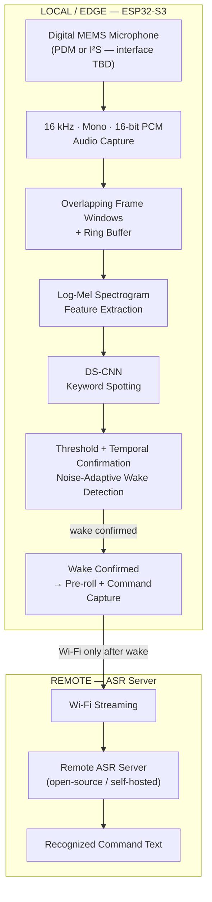

# Low Latency and Efficient Voice Activator for Edge Devices

**SIH (Smart India Hackathon) project** — engineering prototype repository.

The device continuously listens to short audio windows locally using a compact neural network. A small DS-CNN (Depthwise Separable Convolutional Neural Network) checks whether a custom wake word is present. Until the wake word is confirmed, no audio is sent anywhere. Once the wake word is detected, the system preserves recent audio, captures the following command, and sends that command audio over Wi-Fi to a remote ASR (Automatic Speech Recognition) server.

> **Repository status**
>
> This repository contains the implementation and development foundation for the proposed prototype. Not every hardware-dependent component can be validated without the physical ESP32-S3 and selected digital MEMS microphone. The repository does not claim that the complete system is currently a single flash-and-run firmware image. Hardware measurements and end-to-end validation will be recorded only after they are actually performed.

---

## What problem are we solving?

Traditional voice-controlled IoT systems often send audio to a remote server continuously — even when the user has not yet issued a command. This causes:

- unnecessary audio transmission
- network dependence just to detect a wake word
- extra latency before the device responds
- privacy exposure (continuous audio sent to the cloud)
- difficulty running on constrained edge hardware

---

## What is our approach?

Move the **wake-word decision entirely to the edge device** (ESP32-S3).

- The ESP32-S3 runs a compact DS-CNN model locally.
- The model processes overlapping Log-Mel spectrogram windows continuously.
- **No audio is transmitted until the wake word is confirmed.**
- Only the command that follows the wake word is streamed over Wi-Fi to the ASR server.

---

## How the system works



**Key principle: Local wake detection → network only after wake.**

---

## What is implemented in this repository?

| Component | Status | Notes |
|---|---|---|
| Project architecture | ✅ Designed | Architecture defined and documented |
| Python audio preprocessing | ✅ Implemented | WAV load, framing, Log-Mel features |
| Dataset tooling | ✅ Implemented | Inspect, split, validate, label |
| DS-CNN model + training | ✅ Implemented | Compact model, configurable classes |
| Model evaluation | ✅ Implemented | Accuracy, confusion matrix, per-class |
| Model export (TFLite) | ✅ Implemented | Path to embedded format |
| Host-side pipeline tests | ✅ Implemented | Audio, features, ring buffer, wake logic |
| Benchmark framework | ✅ Implemented | Framework exists; values pending hardware |
| Remote ASR server | ✅ Scaffolded | FastAPI server, configurable ASR backend |
| ESP-IDF firmware structure | ✅ Scaffolded | Project compiles; hardware validation pending |
| Audio capture abstraction | 🔶 Hardware-dependent | Requires microphone + board selection |
| Embedded feature extraction | 🔶 Hardware-dependent | Requires ESP32-S3 target validation |
| ESP32 KWS inference | 🔶 Hardware-dependent | Requires deployed model on target |
| Wi-Fi command streaming | 🔶 Hardware-dependent | End-to-end hardware validation pending |
| Full end-to-end demo | ❌ Pending | Requires physical integration |
| <256 KB RAM | ❌ Not yet measured | Hardware benchmark required |
| <10% CPU | ❌ Not yet measured | Hardware benchmark required |
| False activations/hour | ❌ Not yet measured | Real environment test required |
| Wake-to-ASR latency | ❌ Not yet measured | Physical end-to-end measurement required |

---

## What is not implemented / not yet hardware validated?

- **Physical microphone capture** — no microphone has been physically selected or wired yet
- **Embedded KWS inference** — model runtime on ESP32-S3 requires hardware validation
- **Wi-Fi command streaming** — firmware Wi-Fi integration requires hardware
- **All hardware performance metrics** (RAM, CPU, latency, false activations) — require real measurements

---

## Current development status

See [`docs/development-status.md`](docs/development-status.md) for the detailed status table.

**Summary:**
- Host ML pipeline: implemented and tested
- ESP-IDF firmware: scaffolded (structure exists, hardware validation pending)
- Remote ASR server: scaffolded (configurable backend)
- Hardware: not yet available for physical validation

---

## Technical design

### Audio pipeline

```
Digital MEMS Microphone → 16 kHz / Mono / 16-bit PCM
→ Overlapping frames (frame_size=400 samples / 25 ms, hop=160 samples / 10 ms)
→ Hann window → FFT → Mel filterbank (40 bins) → log
→ Log-Mel features (shape: [time_steps × 40])
→ DS-CNN input
```

The preprocessing pipeline is identical between training (Python host) and inference (ESP32-S3), preventing train/inference mismatch.

### DS-CNN model

- **Depthwise Separable Convolutional Neural Network**
- Designed for lightweight keyword spotting
- Small parameter count suitable for embedded target
- Classes: keyword / unknown / silence (configurable)
- Export path: TFLite (for ESP32-S3 with TFLite Micro or ESP-DL)

### Wake detection logic

```
window → DS-CNN → confidence
confidence ≥ threshold?
  → temporal confirmation (N consecutive windows)
  → cooldown period
  → wake confirmed
```

Threshold is configurable (`config.py`). Default development value: `0.80` — **not a validated final threshold**.

### Noise-adaptive detection

Background energy is estimated during non-wake periods. A smoothed noise estimate adjusts the detection threshold within configured bounds. This is a simple deterministic method — no second neural network.

### State machine

```
LISTENING → WAKE_DETECTED → COMMAND_CAPTURE / STREAMING → END_OF_COMMAND → LISTENING
```

### Ring buffer / pre-roll

A fixed-size ring buffer holds recent audio. When the wake word is confirmed, the pre-roll audio plus subsequent command audio are available for transmission — preventing the start of the command from being lost.

---

## Hardware

| Item | Status |
|---|---|
| Edge processor | ESP32-S3 (selected) |
| Microphone | Digital MEMS — PDM or I²S (interface not yet finalized) |
| Firmware framework | ESP-IDF |
| Audio baseline | 16 kHz · Mono · 16-bit PCM |

See [`docs/hardware.md`](docs/hardware.md) for detailed hardware documentation.

> Hardware items pending selection: exact ESP32-S3 board, exact microphone part, interface confirmation, wiring.

---

## Machine-learning pipeline

### Training (host)

```bash
# 1. Set up environment
.\scripts\setup_python.ps1

# 2. Prepare dataset
python ml/dataset/prepare_dataset.py --data-dir data/

# 3. Extract features
python ml/preprocessing/extract_features.py --data-dir data/ --output-dir ml/artifacts/

# 4. Train
python ml/training/train.py --config ml/model/model_config.py

# 5. Evaluate
python ml/training/evaluate.py --model ml/artifacts/model.pth

# 6. Export to TFLite
python ml/model/export.py --model ml/artifacts/model.pth --output ml/artifacts/model.tflite
```

> Dataset not included. See [`docs/dataset.md`](docs/dataset.md) for collection instructions.

---

## Performance targets

> These are **project targets**. They are not presented as achieved results until measured on the physical target hardware.

| Metric | Target |
|---|---|
| Runtime RAM | < 256 KB |
| CPU during continuous listening | < 10% |
| KWS inference time | Minimize |
| False activations/hour | Minimize |
| Wake-to-ASR latency | Minimize |

---

## Current measurements

> No hardware measurements have been performed. All metrics below are pending physical validation.

See [`benchmarks/RESULTS.md`](benchmarks/RESULTS.md).

---

## How to run the software prototype

### Requirements

- Python 3.10+
- Windows (PowerShell) or Linux/macOS

### Setup

```powershell
# Windows
.\scripts\setup_python.ps1

# Linux/macOS
bash scripts/setup_python.sh
```

### Run tests

```powershell
# Windows
.\scripts\run_tests.ps1

# Linux/macOS
bash scripts/run_tests.sh
```

### Run the ASR server (standalone)

```bash
cd server/
pip install -r requirements.txt
cp .env.example .env   # edit as needed
python app.py
```

### Check project integrity

```bash
python scripts/check_project.py
```

---

## ESP32-S3 firmware status

> **Hardware-dependent.** The firmware project structure exists and is designed as a real ESP-IDF project. Physical compilation and flashing require ESP-IDF to be installed and the actual ESP32-S3 board to be available.

```bash
# Once ESP-IDF is installed and sourced:
cd firmware/esp32-s3/
idf.py set-target esp32s3
idf.py build
# idf.py flash monitor   # requires physical board
```

See [`firmware/esp32-s3/README.md`](firmware/esp32-s3/README.md) for firmware setup details.

**Hardware-dependent checklist:**

```
[ ] ESP32-S3 board selected
[ ] Digital MEMS microphone selected
[ ] Interface confirmed (PDM/I²S)
[ ] Wiring verified
[ ] 16 kHz capture verified
[ ] Continuous audio capture verified
[ ] Embedded feature extraction verified
[ ] KWS model deployed
[ ] Wake threshold tuned
[ ] Ring buffer verified
[ ] Wi-Fi streaming verified
[ ] Remote ASR verified
[ ] End-to-end command verified
[ ] RAM measured
[ ] CPU measured
[ ] Inference time measured
[ ] False activations/hour measured
[ ] Wake-to-ASR latency measured
```

---

## Remote ASR server

The server is a small Python/FastAPI application that:

- Receives command audio (16 kHz mono PCM) over HTTP or WebSocket
- Validates format
- Performs ASR (configurable backend — Vosk, Whisper, or other)
- Returns recognized text
- Handles errors cleanly

ASR backend is configurable via environment variable. No proprietary cloud voice SDK is required.

---

## Repository structure

```
low-latency-voice-activator/
├── README.md                   ← you are here
├── LICENSE
├── .gitignore
├── AGENTS.md                   ← agent/Codex instructions
├── docs/                       ← all project documentation
├── firmware/esp32-s3/          ← ESP-IDF project
├── ml/                         ← host ML pipeline (preprocessing, model, training)
├── server/                     ← remote ASR server
├── tests/                      ← host-side tests
├── benchmarks/                 ← benchmark framework and results
├── scripts/                    ← setup and utility scripts
└── hardware/                   ← hardware documentation and diagrams
```

---

## Development roadmap

| Stage | Description | Status |
|---|---|---|
| 0 | Repository foundation, documentation | ✅ Complete |
| 1 | Host audio preprocessing pipeline | ✅ Complete |
| 2 | Dataset tooling + DS-CNN model | ✅ Complete |
| 3 | ESP-IDF firmware foundation | ✅ Scaffolded |
| 4 | Embedded KWS integration | 🔶 Hardware-dependent |
| 5 | Network + ASR server | ✅ Scaffolded |
| 6 | Integration | 🔶 Requires hardware |
| 7 | Benchmark framework | ✅ Framework exists |
| 8 | Final documentation pass | ✅ Complete |
| — | Physical hardware validation | ❌ Pending hardware |

---

## Limitations

- No physical prototype has been tested. All embedded performance metrics are pending.
- The wake word is currently a configurable placeholder (`hey_activator`). Training recordings are not yet collected.
- The ASR backend is configurable but not tested end-to-end with hardware.
- ESP-IDF compilation requires the ESP-IDF toolchain to be installed separately.
- Embedded model runtime (TFLite Micro or ESP-DL) requires further hardware evaluation.

---

## Team / project information

**SIH Problem Statement:** Low Latency and Efficient Voice Activator for Edge Devices

Team: Yajuvendra Ghatage (Lead)
      Shreeyash Mahatme
      Piyush Chavan
      Aditya Mukadam
      Aditi Patil
      Rehan Sayyad

---

## License

MIT License. See [LICENSE](LICENSE).
